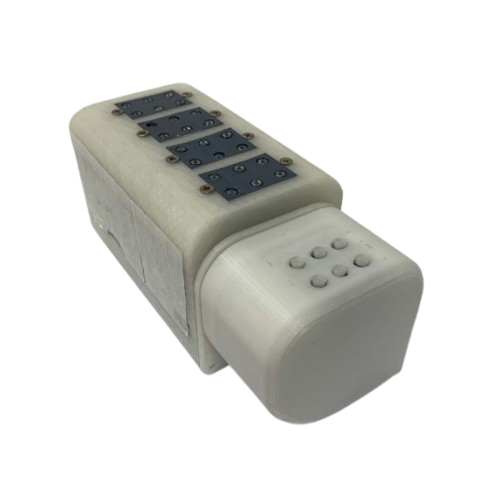
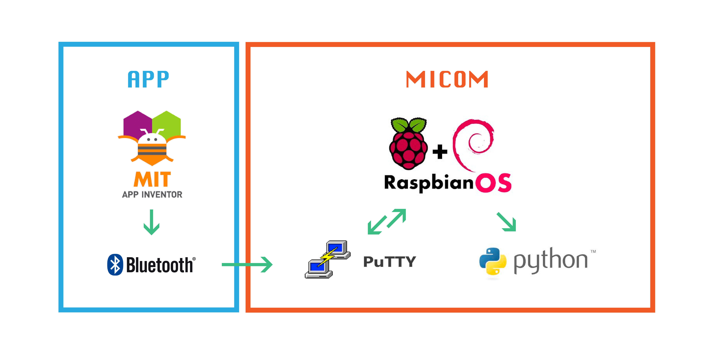
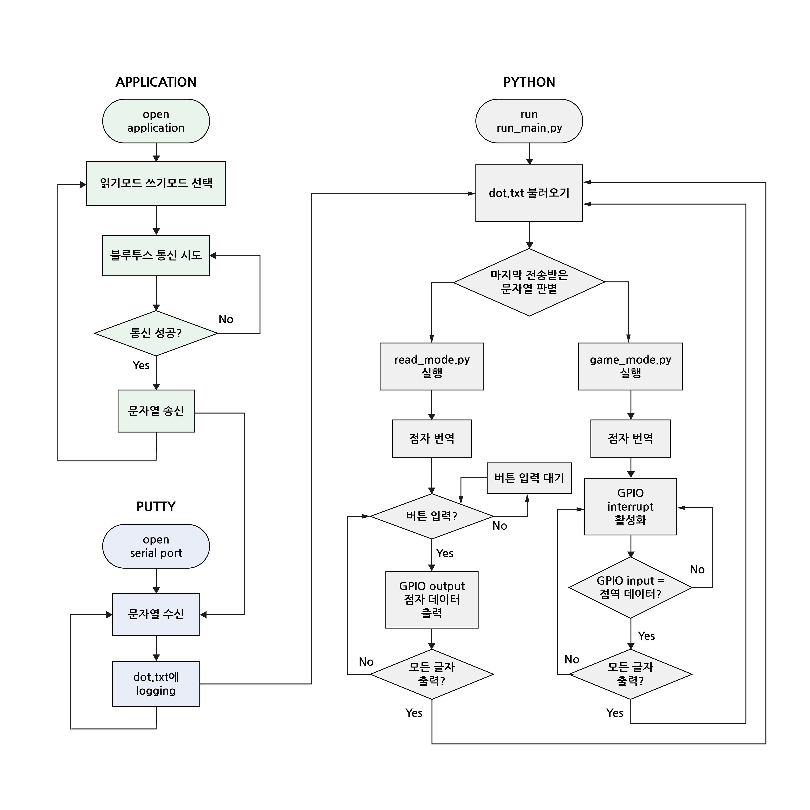
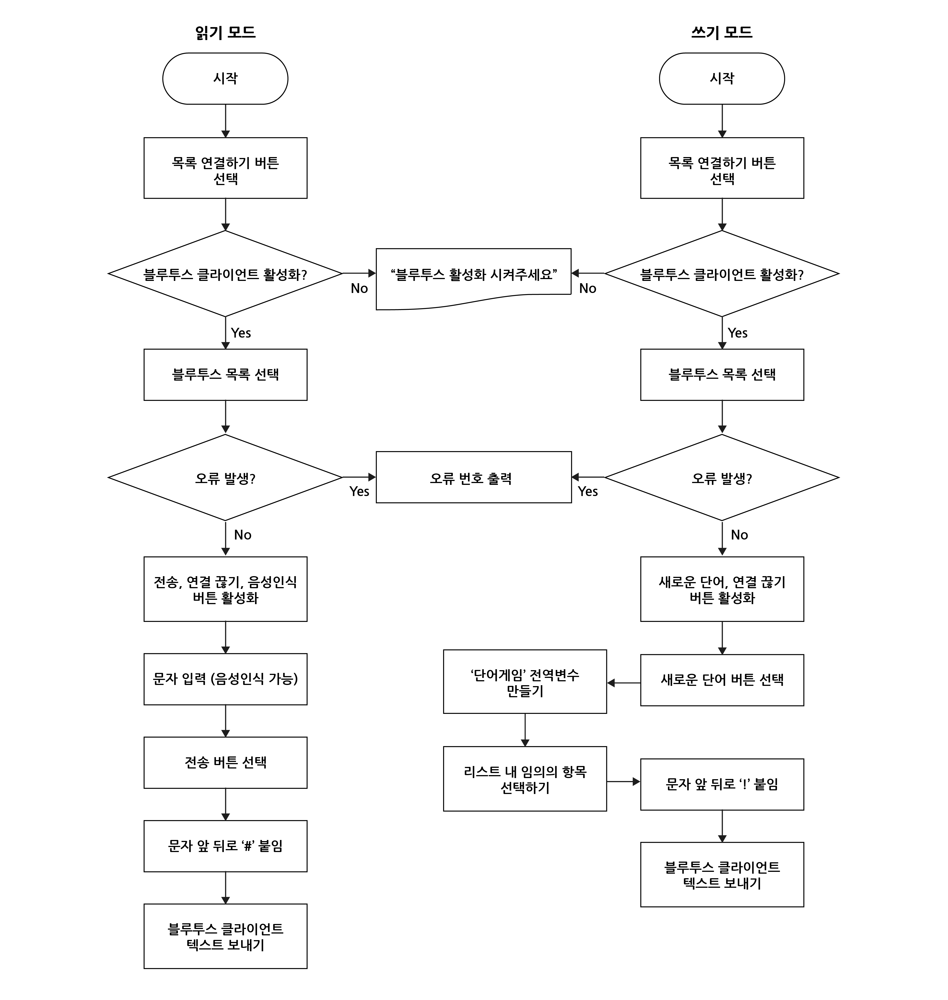

# 2021ESWContest_free_1022

## Project Overview
This project was developed to address the challenges faced by visually impaired individuals in accessing Braille education. The scarcity of Braille education institutions and educators, compounded by restrictions due to the COVID-19 pandemic, has made traditional learning methods less accessible. This project aims to provide a portable and convenient solution for Braille education, allowing users to learn Braille anytime, anywhere, and ultimately improving accessibility.
### Goals:

- **Accessibility**: Enable Braille education for visually impaired individuals in any environment.
- **Portability**: Develop a compact and lightweight Braille learning device that is easy to carry, akin to a vocabulary book.

## Software Composition

## **Main Algorithm Diagram**

## **App Algorithm**

## Documentation

All project-related documentation can be found [here](assets/documentation.pdf).

---

## Acknowledgments

This project was submitted as part of the **2021 Embedded Software Contest**.
